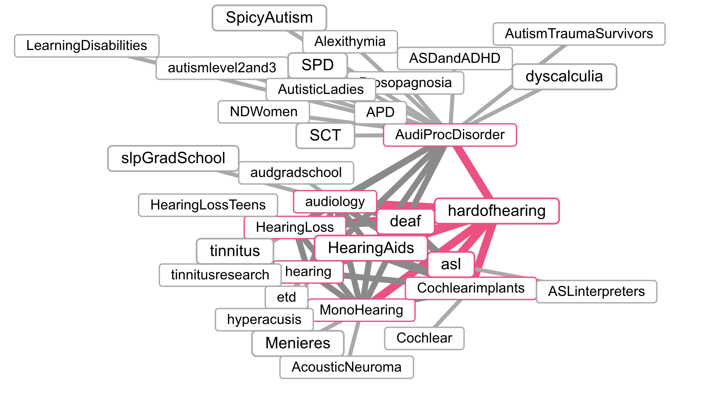

# Master-Thesis
My repo of my master thesis

### Plan of attack
So for the plan of my thesis the goal is scrape reddit. But that all sounds fair and easy but the real importance comes from how are we going to do that. As Reddit consists of billions of posts and comments, it is important to scope which groups we'd like to scrape the data from. The groups must have something related to deaf accessibility for us to gather any useful information for the purpose of the master thesis. 

The above two networks of Graphs was made through the github from sayit. It allows you to find similar reddit groups based on an input reddit group or topic.
[Graph of related subreddits](https://anvaka.github.io/sayit)

### Most promising reddit threads
https://www.reddit.com/r/hardofhearing/
https://www.reddit.com/r/deaf
https://www.reddit.com/r/asl
https://www.reddit.com/r/bsl
https://www.reddit.com/r/HearingLoss

### Reddit API documentation
https://support.reddithelp.com/hc/en-us/articles/16160319875092-Reddit-Data-API-Wiki

---
### 
The goal of this subsection of the thesis is to scrape reddit data around a certain topic, which is for me, the topic of hard of hearing difficulties around the topic of video comprehension. In reddit, individuals can post a post and talk about a topic, and other redditors can comment on such topics. Reddit has a search bar, allowing you to find posts by users that relate to the topic. So if we can gather reddit posts that relate to a topic, we can do subsequent analsyis methods. 

I got an idea for a reddit scraping tool that would work as follows:
1. user defines query to be executed. In as little words as possible
2. user defines subreddits to be searched in
    - We can use https://anvaka.github.io/ to find similar subreddits
    - https://github.com/anvaka/sayit
    - It works through:
        - User defines a starting subreddit
        - System retrieves a list of all possible subreddits (it does this by using the first letter of the subredit, then it requests a .json with this letter from the backend for a set of letters which are dependent on the first letter of the user inputted subreddit. The output of the .json is a nested list of subreddits. Each of the set of subreddits are related to each other. The output jsons are precomputed related subreddits. So each subreddit is findable in each of the single letter json files with nested subreddits. The more frequent a subreddit is found with others, the more important the subreddit is. Meaning that subreddits that are frequently together in a nest of subreddits, are more similar to one another.
        - The similar subreddits are determined through users. Users that respond frequently in subreddit A, proably reply to more similar subreddits. This is how the graph is created. 
3. Wordcloud is generated based on the word2vec nearest other words. -> This might be a bit harder than intitally expected, as the output is not that great. But it might be a good starting point to get new ideas to expand your output. 
4. LLM will determine which word cloud words are most likely to give a good output based on the context the user has given
5. User can remove or add query words from the wordcloud
6. For each of the words in the word cloud, the reddit API is called to extract the posts and all of its comments that relate to the query. This step relies on Reddit's SEO
    - Variable to save from the API 
      - postId
      - title
      - Post content
      - date
      - Redditor ID
      - Redditor tag e.g. deaf or HOH
      - ups
      - downs
      - subreddit_name_prefixed
      - url
      - Comment list
        - CommentId
        - Comment content
        - date
        - redditor ID
        - Redditor Tag
        - ups
        - downs
7. 

### Input words 
Youtube
Subtitles
Netflix
Audio comprehension

### Important fixes for clustering cleaning of text
Word characters such as I'd, the apastrophe would be represented by I\u2019d. It is important to remove such character combination for special characters before clustering. 

### Reddit scraper
SO we have a list of keywords that we want to scrape the posts and its comments for in a subreddit. The search will result in 1-100 posts. So we must determine this number, the default is 25. But the question is whether we should increase this number. Right now it is a fixed number, but if a keyword has a lot or very few hits. We should dynamcally adjust this number or in extreme events, look for the second page of the search result to get more posts. We could do this by having an LLM determine whether the last 3 post relates to the research question, and if this is the case, we look for another set of reddit posts. 

Do something with flair_name which can be VENT -> which are posts that are about venting